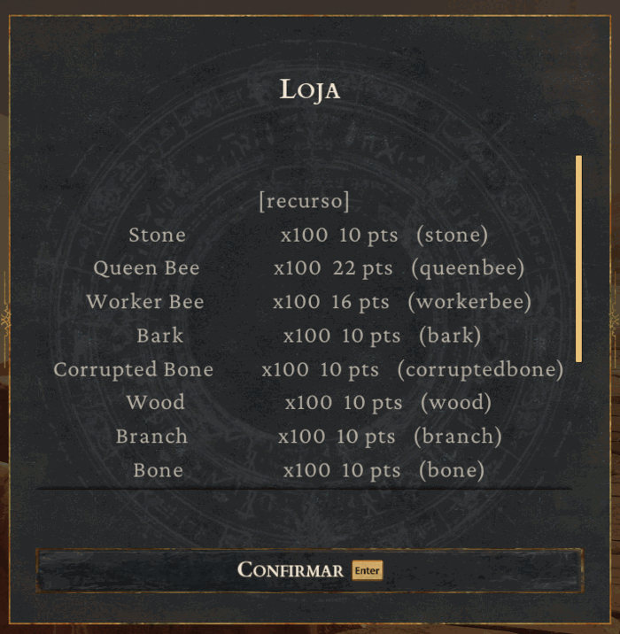
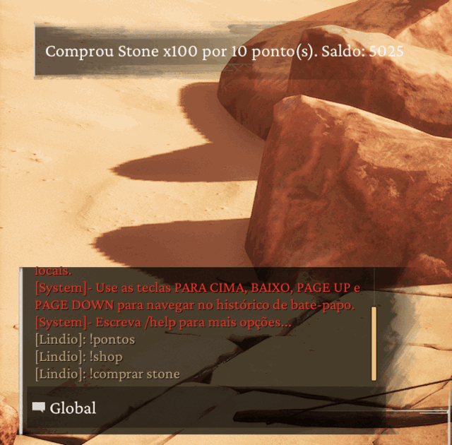
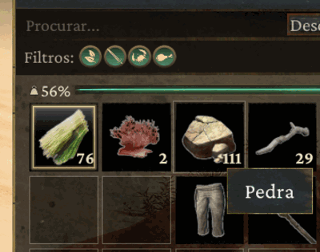

<div align="center">

# Conan Shop

**Uma loja no seu servidor de Conan Exiles.** O jogador ganha pontos por tempo
online, abre a lista com `!shop` e compra com `!comprar`. VIP ganha mais.

*Se você veio do ARK e conhece o **ArkShop** ou o **AsaShop** — é a mesma ideia,
os mesmos comandos, adaptada ao Conan.*



**[Manual completo](Docs/MANUAL.md)** · **[Compilar do fonte](src/COMPILAR.md)** ·
**[Roteiro de teste](Docs/TESTE-COM-JOGADOR.md)** · **[Baixar](../../releases)**

</div>

---

## Como funciona, na prática

**Para o jogador:** ele joga. A cada 5 minutos ganha pontos. Quando quiser,
digita `!shop`, vê o que tem, e compra.

```
!pontos          quanto eu tenho
!shop            a lista, na tela
!shop 2          próxima página
!comprar stone   compra, e o item cai no inventário
```

**Para você, dono do servidor:** instala uma pasta, edita um arquivo, pronto.
Quem ganha quanto, o que se vende e por quanto — tudo no `config.json`.

<table>
<tr>
<td width="50%" valign="top">

**O jogador compra…**



</td>
<td width="50%" valign="top">

**…e o item chega no inventário**



</td>
</tr>
</table>

---

## Instalar

1. Baixe o `ConanShop-v1.0.0.tar.gz` em **[Releases](../../releases)**
2. Descompacte
3. Arraste a pasta `ConanShop` para dentro de:
   ```
   <servidor>/ConanSandbox/Binaries/Win64/Conan-Api/Plugins/
   ```
4. Suba o servidor

Pronto. O banco de pontos nasce sozinho ao lado do plugin.

> **Precisa da [Conan-Api](https://github.com/andrew-mauricio/Conan-Api)
> instalada**, e do plugin **Permission** (vem junto com ela). É do Permission
> que sai a identidade do jogador — a chave da carteira dele — e a noção de VIP.

A pasta fica assim, e é só isso:

```
Conan-Api/Plugins/ConanShop/
   ConanShop.dll      o plugin
   config.json        o que VOCÊ edita
   PluginInfo.json    o cartão de identidade
   conanshop.db       nasce sozinho (os pontos dos jogadores)
```

---

## Se você conhece o ArkShop

É o mesmo desenho, e de propósito. O que muda:

| | ArkShop (ARK e ASA) | Conan Shop |
|---|---|---|
| ganhar pontos | por tempo, por grupo | **igual** |
| ver a loja | `/shop` | `!shop` (configurável) |
| comprar | `/buy id` | `!comprar id` |
| ver saldo | `/points` | `!pontos` |
| recarregar config | `ArkShop.Reload` no RCON | `!shopreload` no chat *(ver abaixo)* |
| VIP | Permissions | Permission |
| banco | SQLite ou MySQL | **igual** |
| o que identifica um item | o caminho da blueprint | **o Template ID** *(ver abaixo)* |

### Duas diferenças que importam

**1. Um item não é uma blueprint.** No ARK vale "uma blueprint = um item". No
Conan não: Pedra (10001) e Enxofre (14171) têm **a mesma** `ItemClass`
(`/Script/ConanSandbox.GameItem`). Centenas de itens simples dividem a mesma
classe — só o **Template ID** distingue.

Uma loja modelada como a do ARK entregaria o item errado para toda essa família,
**funcionando**, sem um erro no log. Por isso aqui se vende por `template_id`,
sempre.

**2. Não há comando de RCON.** O RCON do Conan aceita uma lista fixa de comandos
e não registra novos — isso foi medido, não suposto. Também não dá para pegar
carona no `broadcast`: cinco hooks foram armados ao mesmo tempo, o servidor
respondeu *"Message has been broadcast."* e **nenhum disparou**. O caminho do
RCON é nativo e não passa pela reflexão do jogo.

Em lugar disso, dois caminhos que funcionam:
- `!shopreload` no chat, para quem tem `shop.admin`
- um **arquivo de comandos**, para painel web, script ou SSH (abaixo)

---

## Dar pontos de fora do jogo

Escreva linhas em `Conan-Api/SHOP-COMANDOS`:

```
dar     Indio#76973 500 premio do evento
tirar   A-4QR7CRS0F 100 estorno
definir Indio#76973 0
saldo   Indio#76973
recarregar
```

O plugin atende em até 3 segundos e responde, linha por linha, em
`Conan-Api/SHOP-RESPOSTAS`:

```
linha 1: ok dar A-4QR7CRS0F +500 (saldo 1250)
linha 2: RECUSADO tirar A-9XX -100 — saldo insuficiente (tem 40). NADA foi tirado.
```

Serve para qualquer automação: um painel web escreve o arquivo, um script de
evento premia os vencedores, uma tarefa agendada dá bônus de fim de semana.

---

## O `config.json`

O arquivo é comentado por dentro. O que você mais vai mexer:

```json
"pontos": {
  "minutos": 5,
  "somar": false,
  "grupos": { "default": 5, "vip": 15, "vipplus": 25 }
}
```

Com o padrão, um jogador comum faz **60 pontos por hora**. É a régua para ler os
preços. `"somar": false` dá o **maior** valor entre os grupos do jogador (um VIP
que também está em `default` ganha 15, não 20).

```json
"pedra": {
  "nome": "Pedra",
  "categoria": "recurso",
  "template_id": 10001,
  "quantidade": 100,
  "preco": 10
}
```

A chave (`pedra`) é o que o jogador digita. `"permissao": "shop.vip"` restringe
o item — e ele nem aparece na lista de quem não pode.

**Vem com 120 itens prontos**, de 10 categorias, escolhidos entre os 9.121 que o
jogo tem. Os preços são ponto de partida; refine à vontade.

---

## De onde vem a lista de itens

Do plugin **ExtratorItemTable**, que acompanha a Conan-Api. Com o servidor
carregado, crie o arquivo `Conan-Api/EXTRAIR-ITEMTABLE`. Ele lê a
`/Game/Items/ItemTable` — a tabela canônica da Funcom — e grava:

```
itemtable-conan.json     para programa
itemtable-conan.csv      para planilha (abre no Excel com acento certo)
```

Nesta build são **9.121 itens × 120 colunas**: nome, categoria, tier, DLC,
tamanho de pilha, classe. Ele não depende de alguém ter aberto um baú: lê a
tabela, não os objetos carregados.

---

## O que ele protege, e como

### Ninguém gasta o que não tem, nem duas vezes

O débito é **um único UPDATE com a condição de saldo dentro dele**. Quem decide é
o banco, sob a trava dele — não há intervalo entre "ler o saldo" e "gastar",
porque não se lê antes de gastar.

Medido: 8 clientes simultâneos, 400 tentativas disputando saldo para exatamente
20 compras.

| implementação | passaram | saldo final |
|---|---|---|
| checagem fora do UPDATE | 26 | **−60** |
| condição dentro do UPDATE *(este plugin)* | **20** | **0** |

Isso importa de verdade com dois servidores no mesmo MySQL, onde não existe
trava em comum entre os processos.

### Configuração quebrada não substitui a boa

Você edita o `config.json` às 21h, erra uma vírgula e manda `!shopreload`. O
plugin **recusa** e continua com a anterior, dizendo o motivo. Sem isso, a loja
ficaria vazia no horário de pico — sem erro visível, porque "zero itens" é um
estado válido.

### Se a entrega falhar, o ponto volta

E fica registrado no diário, com o motivo. Quando um jogador disser *"comprei e
não recebi"*, o diário responde.

---

## Testado

Não é "deve funcionar" — cada linha abaixo foi medida:

- carteira e débito atômico, com **controle positivo** que prova que o teste sabe reprovar
- `config.json`: 8 casos, incluindo JSON válido com itens inválidos
- roteamento de comando: 11 casos (`!shop` não engole `!shopreload`)
- fila de comandos: 10 casos, incluindo os que devem falhar
- **e com jogador real dentro do jogo**: `!pontos`, `!shop`, `!comprar` entregando
  100 pedras no inventário, e o crédito por tempo creditando durante o teste

A bateria roda com `testes/rodar.sh`, sob Wine — o ambiente de verdade.

---

## Saber mais

| | |
|---|---|
| **[Manual completo](Docs/MANUAL.md)** | cada chave do `config.json`, o que o plugin protege e o que ele **não** resolve |
| **[Compilar do fonte](src/COMPILAR.md)** | só o mingw-w64; e como conferir que o DLL publicado veio deste código |
| **[Roteiro de teste](Docs/TESTE-COM-JOGADOR.md)** | o que testar dentro do jogo, em ordem, e o que cada falha significa |
| **[Conan-Api](https://github.com/andrew-mauricio/Conan-Api)** | a API que este plugin usa — instale-a primeiro |
| **[Conan-Api-SDK](https://github.com/andrew-mauricio/Conan-Api-SDK)** | para escrever o seu próprio plugin |

---

## Licença

Mesma da Conan-Api: use em quantos servidores quiser, inclusive em servidor que
cobra dos jogadores. Escreva e **venda** seus próprios plugins em cima da API. O
que não pode é revender ou re-hospedar a própria API.

<div align="center">
<sub>Conan Exiles é marca da Funcom. Este projeto é independente e não possui
vínculo, patrocínio ou aprovação da Funcom.</sub>
</div>
